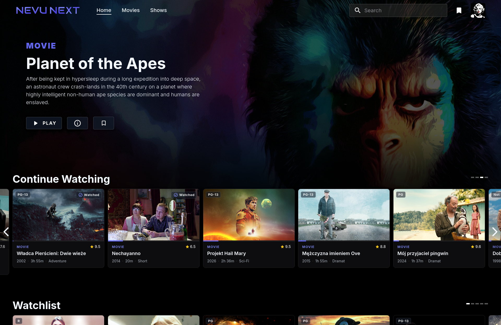

# Nevu Next Plex WebUI

Nevu Next Plex WebUI is a modern, self-hosted alternative web interface for Plex Media Server. It gives movie and TV libraries a faster, cleaner browser experience with Plex Home profiles, adaptive trailers, configurable library views, rich title details, multi-version playback, ratings and reviews, and practical server administration. It runs in Docker and keeps Plex as the media server and source of truth.



## Why this fork exists

I was not looking for another side project. I wanted to open Plex and watch a film.

The official web interface had become unreliable in my setup, while the alternatives I tried were either too bare, partially broken, or mixed the basic Plex experience with unrelated accounts, payments, and services. The original Nevu project was the closest match: it already had the right idea and a strong visual foundation, but login, mobile use, playback details, and several everyday workflows still needed work.

So yes, you are reading the README of a fork created because watching a film turned into debugging a media client. Nevu Next builds on the original project while focusing on a dependable Plex-native experience, practical administration tools, and a codebase that can keep moving forward.

This project is under active development. Expect rough edges, but also expect fixes to target real use rather than a mock interface.

Nevu Next is a modified fork of [Ipmake/NevuForPlex](https://github.com/Ipmake/NevuForPlex), maintained under [GPL-3.0](LICENSE) since 2026.

## Features

- **A cinematic, responsive Plex interface** for desktop and mobile browsers.
- **Plex-native authentication** with Plex Home profile selection, protected-profile PIN entry, and optional profile remembering.
- **Plex Home management** with managed-user names and age restrictions, PINs, household invitations, guest access, member removal, and library permissions, governed by the active profile's Plex permissions.
- **Movie and TV discovery** with search, Continue Watching, watchlists, recommendations, recently added media, new releases, and related-title rows.
- **Configurable library browsing** with watched-state and type filters, multiple sort orders, adjustable card sizes, and landscape or poster layouts saved per Plex Home profile.
- **Plex Watchlist** inside libraries with an optional library filter, search, sorting, and local availability labels; the same view opens the full list from Home.
- **Collections and video/music playlists** alongside library views, with search, sorting, paged contents, and playlist playback in Plex order. Card and title menus add media to existing or new lists. Own playlists support name/description editing, moving and removing individual entries, and deletion; collection editing follows library management permissions. Library menus provide direct links to lists and Watchlist.
- **Personalized navigation** with library pinning, unpinning, and ordering for each profile.
- **Richer title pages** with adaptive trailers, ratings, critic and community reviews, cast, related titles, extras, media details, and technical information.
- **Ratings and reviews** on a consistent 0–10 scale with provider labels, individual friend ratings, community reviews with spoiler protection, and writing or editing your own Plex review.
- **Integrated playback** with quality selection, automatic audio and subtitle matching, seek previews, intro and credits skipping, resume support, and optional automatic next-episode playback.
- **Multiple media versions** with combined audio and subtitle lists; choosing a track automatically switches to the file that contains it.
- **On-demand subtitle search and download** with editable search criteria, language and Forced/SDH preferences, Plex provider results, and automatic selection during playback.
- **Firefox-compatible trailer playback** with Plex Discover fallback when a local trailer is unavailable.
- **Playback-state controls** for watchlists and marking movies, shows, seasons, or episodes as played or unplayed.
- **Metadata administration** with title, sort title, original title, summary, tagline, studio, release date, year, and content-rating editing plus Plex field lock and unlock controls.
- **Plex metadata matching** with editable search criteria, provider candidates, and manager-only Match, Fix Match, and Unmatch actions.
- **Plex library administration** for server managers: create, edit, and delete libraries; browse server folders; scan files; refresh metadata; analyze media; and empty library trash.
- **Plex server preferences** generated from the connected server, with grouped sections, search, advanced options, individual defaults, and saving only edited values. Library preferences use the same fields and validation.
- **Library sharing management** for granting, updating, and removing another Plex user's access without leaving Nevu Next.
- **Original-file downloads** for video, tracks and photos when the active Plex account is allowed, with a choice of available files and versions.
- **Watch Together through Nevu Sync**, which can be disabled for a simpler local installation.
- **Optional native HTTPS** with mounted PEM files or a persistent self-signed certificate.
- **Self-hosted Docker deployment** with reproducible multi-platform images built from lockfiles and published to GHCR.

Nevu Next supports movie and TV workflows, music artist/album pages and track lists,
and photo libraries. Music keeps playing during navigation, with a persistent player
and an editable Plex queue with shuffle and repeat. Reload restores the selected
queue entry and position paused. Artist, album and track menus create or extend music
playlists; saved playlists play from a selected song or shuffled. Photo libraries
offer album browsing and a chronological `All photos` view, with shared filters
and sorting. Their gallery supports fullscreen viewing, zoom, slideshows and
photo information. Music and photos also support personal ratings stored on Plex
for the active profile. It is not an official Plex product and is
not affiliated with Plex, Inc.

Supported browsers: Chrome 117+, Edge 121+, Firefox 121+, and Safari 17+
(including iOS), following [Material UI's browser requirements](https://mui.com/material-ui/migration/upgrade-to-v9/).

## Installation

For a complete installation, use the ready Portainer Stack / Docker Compose example. If Plex already exists, the two Docker commands in the second example are enough. Both variants use the published multi-platform image from GitHub Container Registry.

For all supported environment variables, ports, persistent data, Plex connection options, and TLS mounts, see the [configuration reference](docs/configuration.md).

### Portainer Stack / Docker Compose: Plex + Nevu Next

Use this stack for a complete installation:

```yaml
name: nevu-next

services:
  plex:
    image: plexinc/pms-docker:latest
    restart: unless-stopped
    ports:
      - "32400:32400"
    environment:
      PLEX_CLAIM: claim-REPLACE_ME
      ADVERTISE_IP: http://192.168.1.10:32400/
    volumes:
      - /srv/plex/config:/config
      - /srv/media:/data:ro

  nevu-next:
    image: ghcr.io/dejniel/nevu-next-plex-webui:latest
    restart: unless-stopped
    depends_on:
      - plex
    ports:
      - "3000:3000"
    environment:
      PLEX_SERVER: http://plex:32400
    volumes:
      - nevu-data:/app/data

volumes:
  nevu-data:
```

Replace the server IP, storage paths, and `PLEX_CLAIM` from [plex.tv/claim](https://www.plex.tv/claim), then deploy:

```bash
docker compose up -d
```

Open Plex at `http://192.168.1.10:32400/web` and Nevu Next at `http://192.168.1.10:3000`. The claim token is only needed for Plex's first start.

Timezone, custom Plex user/group IDs, a dedicated `/transcode` mount, hardware acceleration, and additional Plex discovery ports are optional and depend on the host. Add them only when your installation requires them.

### Docker commands: Nevu Next with an existing Plex server

When Plex is already running, pull the current Nevu Next image:

```bash
docker pull ghcr.io/dejniel/nevu-next-plex-webui:latest
```

Then start the container, replacing `PLEX_SERVER` with your server address:

```bash
docker run -d \
  --name nevu-next \
  --restart unless-stopped \
  -p 3000:3000 \
  -v nevu-next-data:/app/data \
  -e PLEX_SERVER=http://192.168.1.10:32400 \
  ghcr.io/dejniel/nevu-next-plex-webui:latest
```

`PLEX_SERVER` must include `http://` or `https://` and must not end with `/`. Open Nevu Next at `http://SERVER_IP:3000`.

### HTTPS

Nevu Next can use its persistent self-signed certificate or existing mounted PEM files. See the [HTTPS configuration](docs/configuration.md#https) for the exact environment variables and volume mounts.

## Contributing

Bug reports and focused pull requests are welcome. Before implementing a large behavioral or architectural change, [open an issue](https://github.com/Dejniel/Nevu-Next-Plex-WebUI/issues) so the direction and Plex API assumptions can be discussed first.

Planned product work is tracked in the [product roadmap](docs/roadmap.md), while
technical cleanup is tracked separately in the
[refactoring roadmap](docs/refactoring-roadmap.md).

Good contributions should:

- Preserve compatibility with real Plex Media Server responses rather than relying only on mocked data.
- Include focused tests for authentication, permissions, metadata mutation, or playback-selection logic when those areas change.
- Keep the browser experience usable on both desktop and mobile layouts.
- Avoid committing Plex tokens, private server addresses, generated builds, or local database files.

Even a bug report with browser details, Plex server version, relevant logs, and exact reproduction steps is useful. Development can also be supported through [Buy Me a Coffee](https://buymeacoffee.com/dejniel).

## Development

Requires Node.js 26.10.0 (`.node-version`) and npm 12.2.0; Docker builds use
Buildx/BuildKit. Run the backend and frontend in separate terminals:

```bash
(cd backend && npm ci && \
  PLEX_SERVER=http://192.168.1.10:32400 npm run dev)

(cd frontend && npm ci && npm start)
```

Open `http://localhost:4000`. Vite proxies API, notification, and Watch Together
requests to `http://localhost:3000`; set `NEVU_DEV_BACKEND` to use another backend.
The SQLite install script is pinned and explicitly approved in
`backend/package.json`; review that approval when updating the driver. Settings
use one SQLite table created on first start, without an ORM or migration CLI.

Checks:

```bash
(cd frontend && npm run typecheck && npm run lint && npm test && npm run build)
(cd backend && npm run lint && npm test)
docker buildx build --load -t nevu-next:test .
```

See the [testing guide](docs/testing.md) for check scope and a standalone Plex
and Nevu environment.
